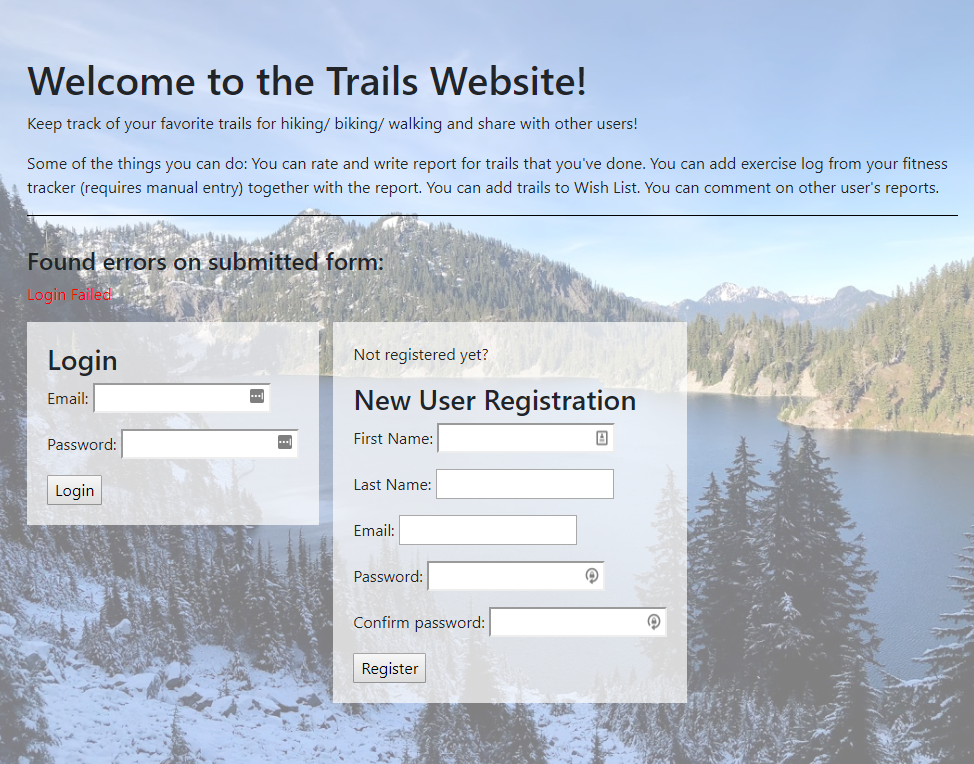
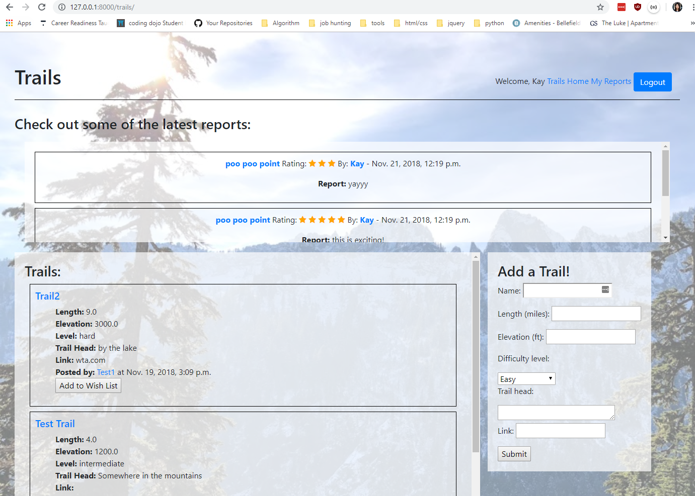
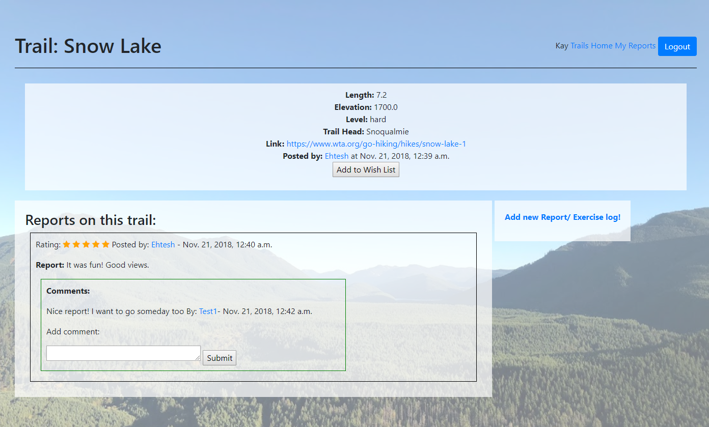
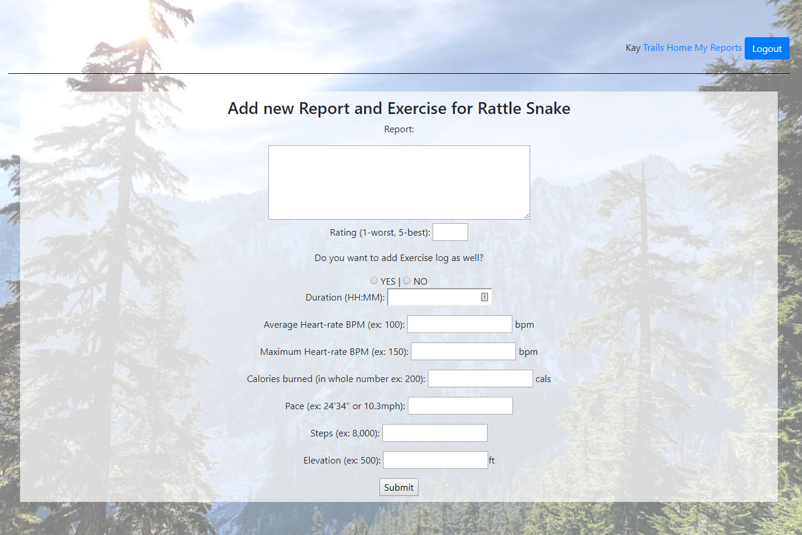
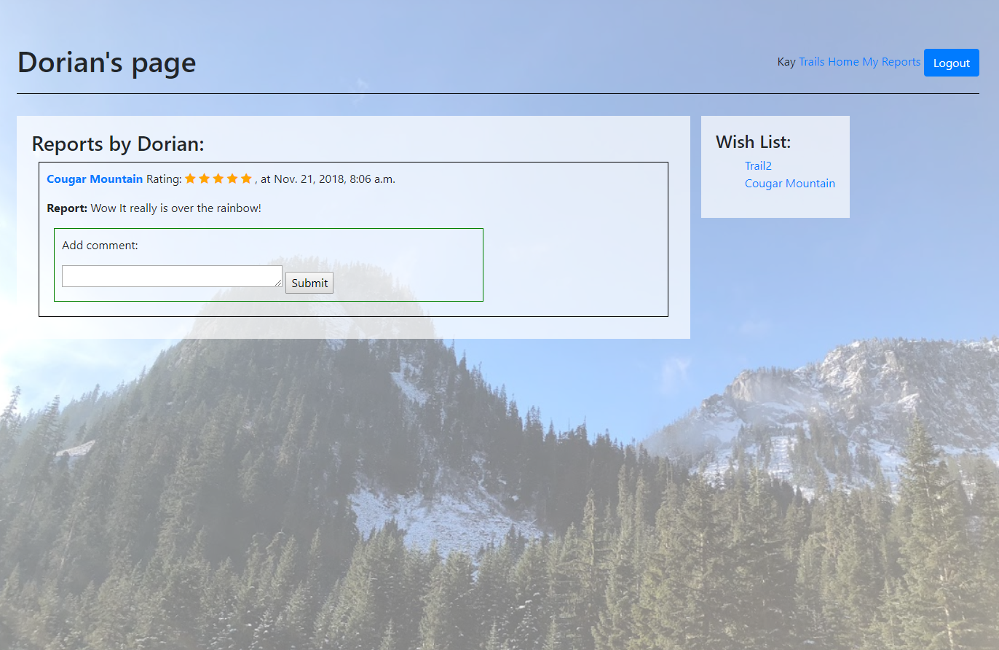

# Trails Website
Website to review and track information about hiking or biking trails. 

## Technologies used:
- Python
- Django
- HTML
- CSS
- bootstrap
- SQLite
- Bcrypt
- ORM
- MTV
- Git
- REGEX

## Features:
- Register and login as user

- Form validation and password encryption

- See three latest reports
- View list of all the Trails
- Add new trail information

- View all reports on a Trail
- Add a trail to wish-list

- Add new report and rating on a trail
- Add exercise log on the report

- Comment on other user's report
- View all the reports from a user

## Database Structure:
- Users 
- Reports: many to one with user, many to one with trail
- Exercises: one to one with report, many to one with user
- Comments: many to one with user, many to one with report